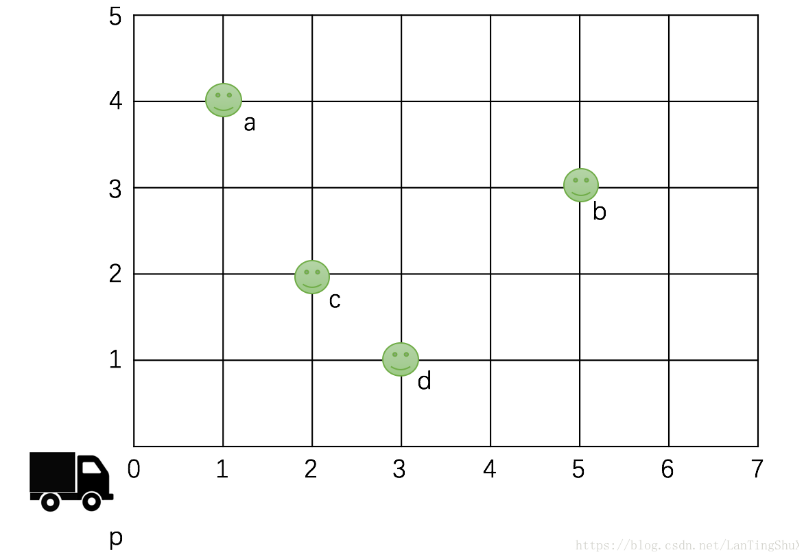

题目如下：

如下图，某物流派送员p，需要给 a、b、c、d. 4个快递点派送包裹，请问派送员需要选择什么样的路线，才能完成最短路程的派送。
假设如图派送员的起点坐标(0,0)，派送路线只能沿着图中的方格边行驶，每个小格都是正方形，且边长为1，如p到d的距离就是4。
随机输入n个派送点坐标，求输出最短派送路线值（从起点开始完成n个点派送并回到起始点的距离）。 

输入示例： 
4 
2,2 
2,8 
4,4 
7,2 
输出： 
30

拿到这道题首先要分析题目，要求最短派送的路线，可以遍历出所有路径一一对比，也可以采用回溯算法。